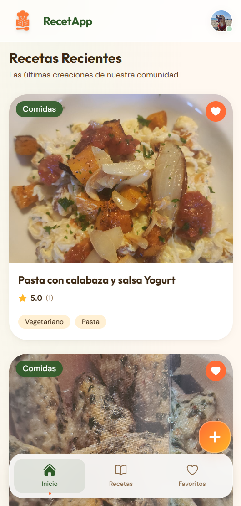
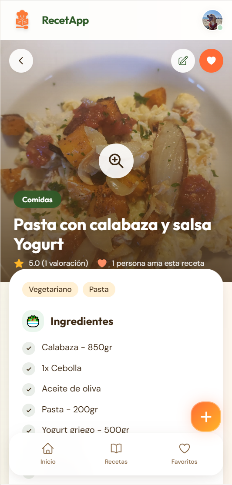
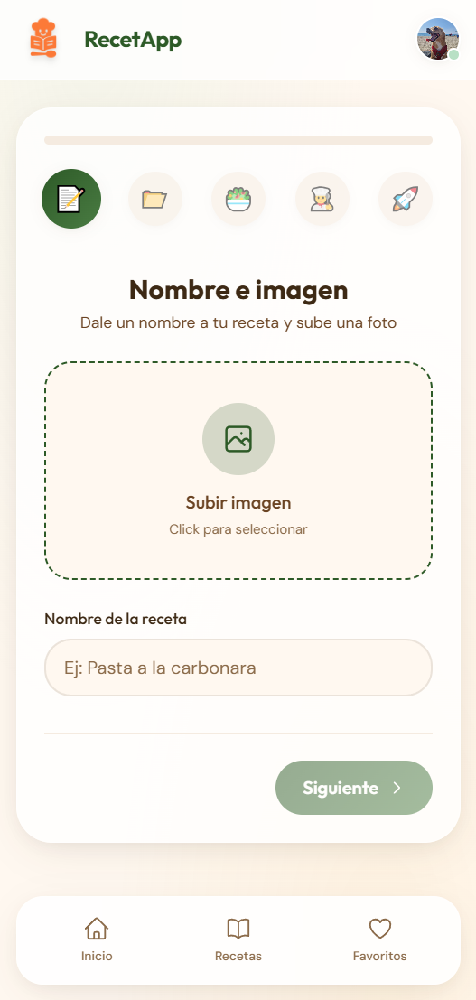
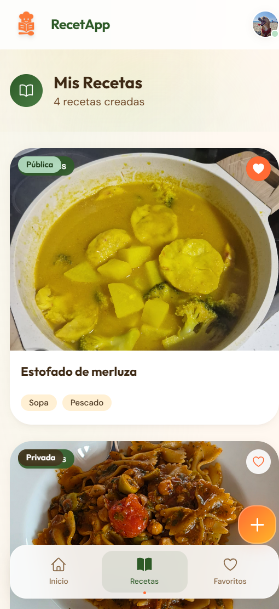
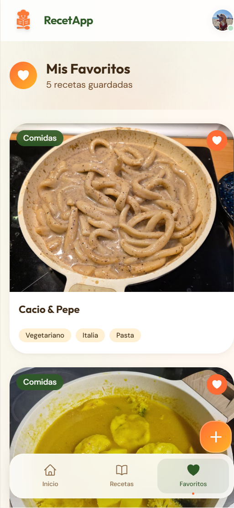
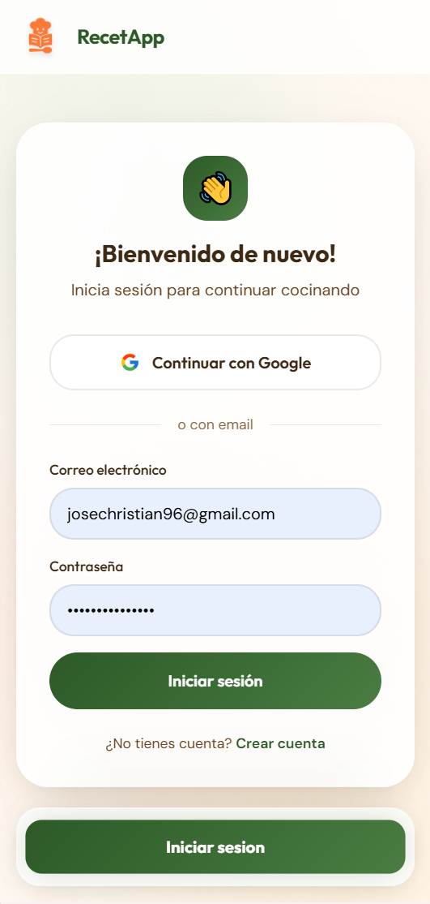

# RecetApp

Una aplicación web moderna para descubrir, crear y compartir recetas de cocina. Desarrollada con React y Firebase.

## Demo en Vivo

**[https://recetapp-759bd.web.app](https://recetapp-759bd.web.app/)**

---

## Tabla de Contenidos

- [Características](#características)
- [Capturas de Pantalla](#capturas-de-pantalla)
- [Tecnologías](#tecnologías)
- [Instalación](#instalación)
- [Estructura del Proyecto](#estructura-del-proyecto)
- [Funcionalidades](#funcionalidades)
- [Base de Datos](#base-de-datos)
- [Autores](#autores)
- [Licencia](#licencia)

---

## Características

- **Explorar Recetas**: Navega por un catálogo de recetas organizadas por categorías
- **Crear Recetas**: Formulario intuitivo por pasos para agregar tus propias recetas
- **Sistema de Favoritos**: Guarda tus recetas favoritas para acceder fácilmente
- **Valoraciones y Comentarios**: Califica recetas con estrellas (1-5) y deja comentarios
- **Perfil de Usuario**: Gestiona tu cuenta y visualiza tus recetas
- **Autenticación Segura**: Login con email/contraseña o Google
- **Panel de Administración**: Gestión de usuarios y categorías (solo admins)
- **Diseño Responsivo**: Optimizado para móvil, tablet y escritorio
- **Modo Público/Privado**: Controla la visibilidad de tus recetas

---

## Capturas de Pantalla

### Página de Inicio
La página principal muestra todas las recetas públicas con opciones de filtrado por categoría.

<div align="center">
  
</div>

### Detalle de Receta
Vista completa de una receta con ingredientes, pasos de preparación y sección de valoraciones.

<div align="center">
  
</div>

### Crear Receta
Formulario por pasos para agregar nuevas recetas.

<div align="center">
  
</div>

### Mis Recetas
Panel para gestionar las recetas creadas por el usuario.

<div align="center">
  
</div>

### Favoritos
Colección de recetas guardadas como favoritas.

<div align="center">
  
</div>

### Autenticación
Páginas de inicio de sesión y registro.

<div align="center">
  
</div>

---

## Tecnologías

### Frontend
| Tecnología | Descripción |
|------------|-------------|
|  | Biblioteca de UI |
|  | Navegación SPA |
|  | Framework de estilos |

### Backend & Servicios
| Tecnología | Descripción |
|------------|-------------|
|  | Plataforma backend |
|  | Base de datos NoSQL |
|  | Autenticación |
|  | Hosting |

### Herramientas de Desarrollo
| Tecnología | Descripción |
|------------|-------------|
|  | Entorno de ejecución |
|  | Gestor de paquetes |
|  | Control de versiones |

---

## Instalación

### Prerrequisitos

- Node.js 18.x o superior
- npm o yarn
- Cuenta de Firebase

## Estructura del Proyecto

```
RecetApp/
├── public/
│   ├── assets/
│   │   └── screenshots/      # Capturas de pantalla
│   └── index.html
├── src/
│   ├── components/
│   │   ├── icons/            # Iconos SVG (Home, Heart, Star, etc.)
│   │   ├── reviews/          # Componentes de valoraciones
│   │   │   ├── StarRating.js
│   │   │   ├── StarDisplay.js
│   │   │   ├── ReviewForm.js
│   │   │   ├── ReviewItem.js
│   │   │   ├── ReviewList.js
│   │   │   └── ReviewSummary.js
│   │   ├── ui/               # Componentes UI reutilizables
│   │   │   ├── Button.js
│   │   │   ├── Input.js
│   │   │   ├── LoadingSpinner.js
│   │   │   └── EmptyState.js
│   │   ├── BottomNavBar.js   # Navegación móvil
│   │   ├── RecipeCard.js     # Tarjeta de receta
│   │   ├── RecipeForm.js     # Formulario de receta
│   │   ├── CategoryCard.js   # Tarjeta de categoría
│   │   └── Modal.js          # Modal reutilizable
│   ├── pages/
│   │   ├── admin/
│   │   │   └── UsersPage.js  # Panel de usuarios
│   │   ├── HomePage.js       # Página principal
│   │   ├── RecipePage.js     # Detalle de receta
│   │   ├── AddRecipePage.js  # Crear receta
│   │   ├── EditRecipePage.js # Editar receta
│   │   ├── CategoryPage.js   # Recetas por categoría
│   │   ├── CategoriesPage.js # Gestión de categorías
│   │   ├── MisRecetasPage.js # Mis recetas
│   │   ├── MisFavoritosPage.js # Favoritos
│   │   ├── UserProfilePage.js # Perfil de usuario
│   │   ├── LoginPage.js      # Inicio de sesión
│   │   └── SignupPage.js     # Registro
│   ├── images/               # Imágenes estáticas
│   ├── AuthContext.js        # Contexto de autenticación
│   ├── RecipesContext.js     # Contexto de recetas
│   ├── CategoriesContext.js  # Contexto de categorías
│   ├── IngredientsContext.js # Contexto de ingredientes
│   ├── ReviewsContext.js     # Contexto de valoraciones
│   ├── firebase.js           # Configuración Firebase
│   ├── App.js                # Componente principal
│   ├── index.js              # Punto de entrada
│   └── index.css             # Estilos globales
├── firestore.rules           # Reglas de seguridad
├── tailwind.config.js        # Configuración Tailwind
├── package.json
├── CHANGELOG.md              # Historial de cambios
└── README.md
```

---

## Funcionalidades

### Autenticación
- Registro con email y contraseña
- Inicio de sesión con email/contraseña
- Inicio de sesión con Google
- Recuperación de contraseña
- Cierre de sesión

### Recetas
- Crear recetas con formulario por pasos
- Subir imagen principal
- Agregar ingredientes dinámicamente
- Definir pasos de preparación con imágenes opcionales
- Editar recetas propias
- Eliminar recetas con confirmación
- Marcar recetas como públicas o privadas
- Zoom de imágenes en detalle

### Favoritos
- Agregar/quitar recetas de favoritos
- Ver contador de favoritos por receta
- Página dedicada de favoritos

### Valoraciones
- Calificar recetas con 1-5 estrellas
- Escribir comentarios opcionales
- Editar valoraciones propias
- Eliminar valoraciones propias
- Ver promedio y total de valoraciones
- Paginación de comentarios

### Categorías
- Filtrar recetas por categoría
- Administrar categorías (solo admin)
- Crear, editar y eliminar categorías

### Usuario
- Ver y editar perfil
- Cambiar foto de perfil
- Ver recetas propias
- Roles: usuario normal y administrador

---

### Reglas de Seguridad

Las reglas de Firestore están configuradas para:
- Permitir lectura pública de recetas públicas
- Permitir a usuarios autenticados leer todas las recetas
- Solo el creador puede editar/eliminar sus recetas
- Solo el autor puede editar/eliminar sus valoraciones
- Validación de rating entre 1 y 5

---

## Paleta de Colores

| Color | Hex | Uso |
|-------|-----|-----|
| Forest | `#2D5A27` | Color primario, botones principales |
| Tangerine | `#FF6B35` | Acentos, favoritos, CTAs |
| Honey | `#FFB627` | Estrellas, destacados |
| Mint | `#B8E0C5` | Fondos secundarios, badges |
| Cocoa | `#3D2914` | Texto principal |
| Cream | `#FFF8F0` | Fondos claros |

---

## Autores

- **JoseCristhianRG** - [GitHub](https://github.com/JoseCristhianRG)

---

## Agradecimientos

- [React](https://reactjs.org/)
- [Firebase](https://firebase.google.com/)
- [Tailwind CSS](https://tailwindcss.com/)
- [Heroicons](https://heroicons.com/) - Inspiración para iconos

---

<div align="center">
  <p>Hecho con amor y buen provecho</p>
  <p>RecetApp - 2025</p>
</div>
